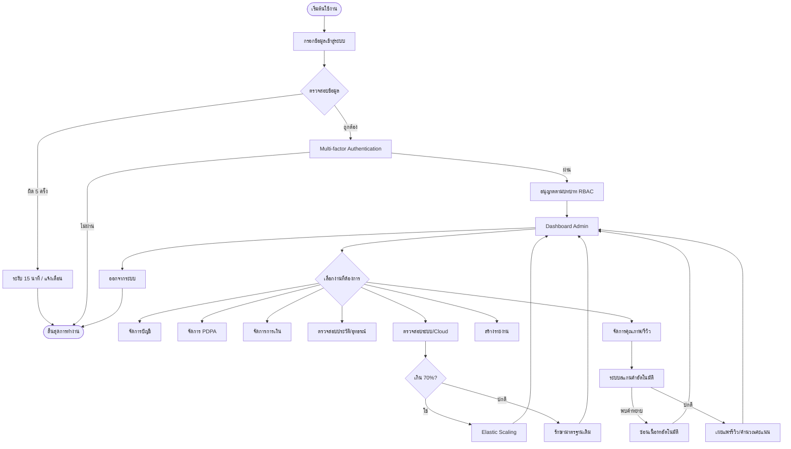

นี่คือ User Flow ของระบบ Admin ที่รวบรวมขั้นตอนและเงื่อนไขตามที่คุณให้มา โดยสรุปออกมาเป็นโครงสร้าง Markdown และไดอะแกรมเพื่อให้เห็นภาพรวมของระบบครับ

---

## 🔐 1. กระบวนการเข้าสู่ระบบ (Authentication Flow)

| ลำดับขั้นตอน | เงื่อนไข / การตัดสินใจ | ผลลัพธ์ |
| --- | --- | --- |
| **เริ่มต้น** | Admin เข้าสู่ระบบ | กรอกข้อมูล Username/Password |
| **ตรวจสอบข้อมูล** | ข้อมูลถูกต้องหรือไม่? | • **ใช่:** ไปที่ขั้นตอน MFA 

 • **ไม่:** (สะสมครบ 5 ครั้ง) $\rightarrow$ **ระงับเข้าถึง 15 นาที** + แจ้งเตือนความปลอดภัย |
| **ยืนยันตัวตน** | Multi-factor Authentication | • **ผ่าน:** อนุญาตเข้าสู่ระบบตามบทบาท (RBAC) 

 • **ไม่ผ่าน:** กลับไปหน้า Login หรือสิ้นสุดการทำงาน |
| **Dashboard** | เข้าสู่หน้าหลัก Admin | เลือกเมนูงานที่ต้องการจัดการ |

---

## 🛠️ 2. การจัดการงานหลัก (Main Admin Tasks)

เมื่อเข้าสู่ Dashboard แล้ว Admin สามารถเลือกทำรายการได้ 7 หมวดหลัก ดังนี้:

### 👤 ก. จัดการบัญชี (Account Management)

* **ตรวจสอบคำขอลงทะเบียน (Service Operator):**
* ตรวจสอบเอกสารและใบรับรอง
* **เอกสารถูกต้อง:** เปลี่ยนสถานะเป็น `Approved` $\rightarrow$ เปิดสิทธิ์การรับงาน
* **ไม่ถูกต้อง/หมดอายุ:** ระงับหรือปฏิเสธบัญชี $\rightarrow$ แจ้งให้ส่งเอกสารใหม่ $\rightarrow$ **บันทึก Audit Log**

### 🛡️ ข. จัดการ PDPA (Privacy & Compliance)

* **จัดการคำร้องขอใช้สิทธิ์ (Data Subject Rights):**
* มีคำขอยกเลิกบริการหรือไม่?
* **มี:** ดำเนินการถอนความยินยอม หรือลบข้อมูล $\rightarrow$ **บันทึก Audit Log**
* **การจัดเก็บ:** เก็บรักษาบันทึกอย่างน้อย **3 ปี**

### 💰 ค. จัดการการเงิน (Financial Management)

* **ตรวจสอบธุรกรรม & ประวัติการชำระเงิน:**
* ตรวจสอบเงื่อนไขนโยบายยกเลิก
* **เข้าเงื่อนไข:** คืนเงินลูกค้า (อัตโนมัติ/ยืนยัน) $\rightarrow$ หักค่าธรรมเนียม/ค่าชดเชย
* **ไม่เข้าเงื่อนไข:** บันทึก Audit Log

* **ปรับค่าคอมมิชชัน:** ดำเนินการผ่านระบบพารามิเตอร์

### 📜 ง. ตรวจสอบประวัติ (Appeals & History)

* **ตรวจสอบแหล่งข้อมูล:** มีการยื่นอุทธรณ์หรือไม่?
* **มี:** บันทึก Audit Log $\rightarrow$ ตรวจสอบหลักฐานภายใน **3 วันทำการ** $\rightarrow$ ตัดสินผล (คงคะแนนเดิม หรือ ปรับเปลี่ยนตามเหมาะสม)
* **ไม่มี:** คงคะแนนไว้ตามเดิม

### 🖥️ จ. ตรวจสอบระบบ (System Monitoring)

* **เฝ้าระวังระบบ (Availability ≥ 99.9%):**
* ตรวจสอบการใช้งานทรัพยากรคลาวด์
* **เกิน 70% ของโควตา:** ขยายทรัพยากรอัตโนมัติ (**Elastic Scaling**)
* **ปกติ:** รักษาการทำงานตามมาตรฐานเดิม

* **Audit Log:** บันทึกการเปลี่ยนแปลงข้อมูลทุกขั้นตอน

### 📊 ฉ. สร้างรายงาน (Reporting)

* **รวบรวมข้อมูล (Daily/Weekly/Monthly):**
* ตรวจสอบความครบถ้วนของข้อมูล
* **ครบถ้วน:** สร้างไฟล์ **CSV/XLSX** เพื่อวิเคราะห์
* **ไม่ครบถ้วน:** แสดงเครื่องหมาย `-` หรือค่าว่าง $\rightarrow$ **แจ้งเตือน Admin**

### ✨ ช. จัดการคุณภาพ (Quality Control)

* **กลั่นกรองรีวิว (ระบบสแกนคำอัตโนมัติ):**
* **พบคำหยาบคาย/ข้อมูลส่วนตัว:** ซ่อนเนื้อหาอัตโนมัติก่อนแสดงผลสาธารณะ
* **เนื้อหาปกติ:** เผยแพร่รีวิว $\rightarrow$ คำนวณคะแนนเฉลี่ย

---

## 🚪 3. การออกจากระบบ (Exit Flow)

* Admin เลือก **ออกจากระบบ**
* ระบบทำลาย Session
* **สิ้นสุดการทำงาน**

---

### 🗺️ Visual Flow (Mermaid Diagram)

หากคุณใช้ Markdown Editor ที่รองรับ Mermaid (เช่น Notion, GitHub, Obsidian) คุณสามารถใช้ Code นี้แสดงเป็นแผนภาพได้ครับ:

หวังว่าโครงสร้างนี้จะช่วยให้การนำไปเขียน Document หรือพัฒนาต่อทำได้ง่ายขึ้นนะครับ! มีส่วนไหนอยากให้เจาะลึกเป็นพิเศษไหมครับ?