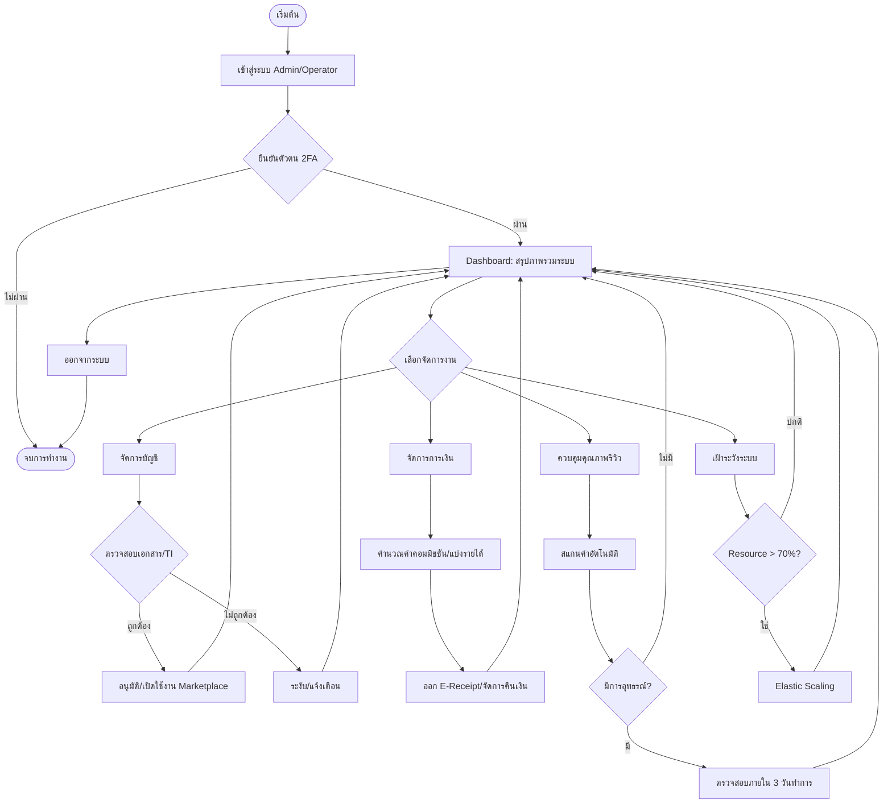

# 🛡️ User Flow: Admin & Platform Operator (CareDee System)

เอกสารฉบับนี้สกัดขั้นตอนการทำงาน (User Flow) ของ Admin และ Platform Operator จากเอกสาร SRS (v1.1) และข้อกำหนดโครงการ เพื่อใช้เป็นแนวทางในการพัฒนาระบบหลังบ้าน

---

## 🔐 1. กระบวนการเข้าสู่ระบบและรักษาความปลอดภัย (Auth & Security Flow)

| ลำดับขั้นตอน | รายละเอียด / เงื่อนไข | อ้างอิง SRS |
| --- | --- | --- |
| **Login** | กรอก Username และ Password | FR-UM-001 |
| **Check Limit** | หากล็อกอินผิดติดต่อกัน **5 ครั้ง** $\rightarrow$ **ระงับ 15 นาที** | Module 3.2.1 |
| **MFA** | ต้องผ่านการยืนยันตัวตนสองขั้นตอน (Two-Factor Authentication) | NF-SEC-003 |
| **RBAC** | ระบบตรวจสอบบทบาทและสิทธิ์ (Role-Based Access Control) | PF-ADM-002 |
| **Dashboard** | แสดงข้อมูลสรุป (Real-time Metrics: จอง, รายได้, คะแนน) | PF-OP-001 |

---

## ⚙️ 2. การจัดการงานระบบหลัก (Main Operational Flows)

### 👤 ก. การจัดการบัญชีและอนุมัติ (Account & Verification)
1. **Receive Request:** ตรวจสอบคำขอลงทะเบียนใหม่จากผู้ดูแล (Caregiver) หรือผู้ให้บริการ (Operator)
2. **Verify Documents:** ตรวจสอบใบรับรอง (Certificates) จากสถาบันฝึกอบรมผ่านระบบเชื่อมต่อ (TI Interface)
3. **Action:**
   - **Approve:** อนุมัติการเข้าถึง $\rightarrow$ ส่งสถานะไปยัง Marketplace เพื่อเปิดโปรไฟล์
   - **Reject/Suspend:** หากเอกสารไม่ครบหรือหมดอายุ $\rightarrow$ แจ้งเตือนผ่านระบบ
4. **Audit:** บันทึกการเปลี่ยนแปลงข้อมูลลงใน **Audit Log** (เก็บไว้อย่างน้อย 3 ปี)

**อ้างอิง:** PF-OP-003, PF-TI-002, FR-UM-003

### 💰 ข. การจัดการการเงิน (Financial Management)
1. **Monitor Transactions:** ตรวจสอบรายการชำระเงินผ่านช่องทางดิจิทัล (3 รูปแบบหลัก)
2. **Revenue Distribution:** ระบบคำนวณและหักค่าคอมมิชชันอัตโนมัติตามพารามิเตอร์ที่ตั้งไว้
3. **E-Receipt:** ตรวจสอบการออกใบเสร็จอิเล็กทรอนิกส์ (PDF) ให้สอดคล้องกับกฎหมายภาษี
4. **Refunds:** กรณีมีการยกเลิกตามเงื่อนไข $\rightarrow$ อนุมัติคืนเงินผ่าน Webhook ของ Payment Gateway

**อ้างอิง:** PF-PM-002, FR-PM-003, PF-PM-004

### ✨ ค. การควบคุมคุณภาพและข้อพิพาท (Quality & Appeals)
1. **Content Moderation:** ระบบสแกนคำหยาบ/ข้อมูลส่วนตัวอัตโนมัติในรีวิว
2. **Manual Review:** Admin ตรวจสอบรีวิวที่ถูกซ่อนเพื่อยืนยันความถูกต้อง
3. **Appeals:** หากมีการยื่นอุทธรณ์ผลการรีวิว $\rightarrow$ Admin ต้องตรวจสอบหลักฐานและตัดสินภายใน **3 วันทำการ**
4. **Action:** ปรับเปลี่ยนคะแนน หรือ คงเดิม $\rightarrow$ แจ้งผลผู้เกี่ยวข้อง

**อ้างอิง:** FR-RR-003, FR-RR-004

---

## 📊 3. การเฝ้าระวังและรายงาน (Monitoring & Reporting)

### 🖥️ การเฝ้าระวังระบบ (System Monitoring)
- **Availability:** ตรวจสอบสถานะระบบ (ต้องไม่น้อยกว่า **99.9%**)
- **Resource Usage:** หากการใช้งาน Cloud เกิน **70%** ของโควตา $\rightarrow$ ระบบทำ **Elastic Scaling** อัตโนมัติ
- **Incident Alert:** รับการแจ้งเตือนทันทีหาก Service ภายนอก (Payment, SMS) ขัดข้อง

**อ้างอิง:** NF-REL-001, PC-004, NF-REL-005

### 📈 การสร้างรายงาน (Reporting)
- **Data Gathering:** รวบรวมข้อมูลสถิติรายวัน/สัปดาห์/เดือน
- **Export:** สร้างรายงานในรูปแบบ **CSV** หรือ **XLSX**
- **Analysis:** สร้างรายงานวิเคราะห์แนวโน้มทักษะที่ตลาดต้องการเพื่อส่งต่อให้สถาบันฝึกอบรม

**อ้างอิง:** PF-OP-004, PF-TI-004

---

## 🗺️ Visual Flow (Mermaid Diagram)

---
*หมายเหตุ: Audit Log จะถูกบันทึกในทุกขั้นตอนที่มีการเปลี่ยนแปลงข้อมูลสำคัญเพื่อความโปร่งใส*
