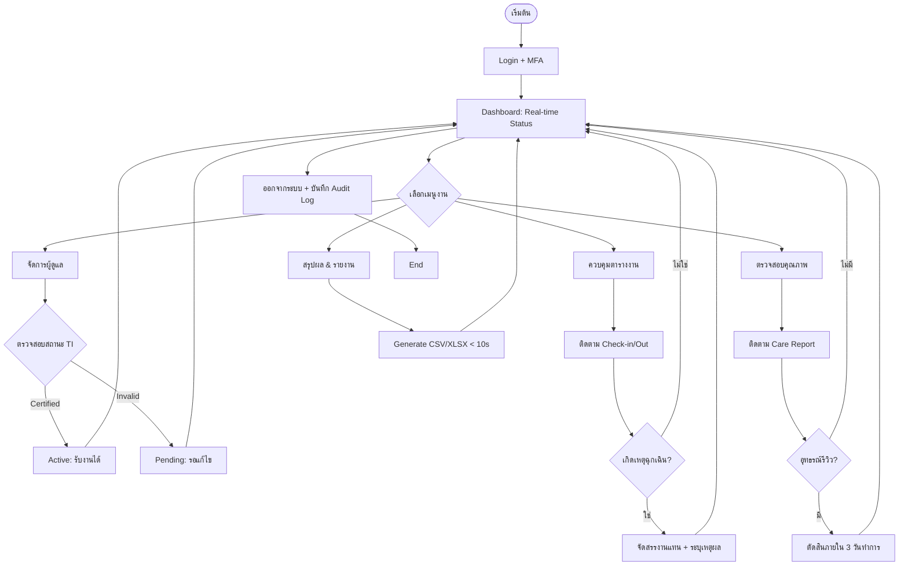

# 📋 User Flow: Service Operator (CareDee Platform)

เอกสารฉบับนี้สกัดขั้นตอนการทำงาน (User Flow) ของผู้ให้บริการ (Service Operator) จากเอกสาร SRS (v1.1) และข้อกำหนดโครงการ เพื่อใช้เป็นมาตรฐานในการปฏิบัติงานและการพัฒนาระบบ

---

## 🔐 1. กระบวนการเข้าสู่ระบบและรักษาความปลอดภัย (Auth & Security Flow)

| ลำดับขั้นตอน | รายละเอียด / เงื่อนไข | อ้างอิง SRS |
| --- | --- | --- |
| **Portal Login** | เข้าใช้งานผ่าน Web Portal โดยใช้รหัสพนักงาน | PF-OP-001 |
| **Security Logic** | ล็อกอินผิด **5 ครั้ง** $\rightarrow$ **Account Lockout 15 นาที** | Module 3.2.1 |
| **MFA** | บังคับใช้การยืนยันตัวตนสองขั้นตอน (Two-Factor Authentication) | NF-SEC-003 |
| **Dashboard** | ข้อมูล Refresh ทุก **60 วินาที** (Metric: จอง, รายได้, รีวิว) | FR-OP-001 |

---

## 👥 2. การจัดการฐานข้อมูลผู้ดูแล (Caregiver Management)
1. **Verify New Requests:** ตรวจสอบรายชื่อผู้ดูแลใหม่ที่สมัครเข้าสังกัด
2. **Document Check:** ตรวจสอบเอกสารรับรองร่วมกับสถาบันฝึกอบรม (Certified Status)
3. **Approval Logic (PF-OP-001):**
   - **Approved:** อนุมัติสิทธิ์การรับงาน $\rightarrow$ ข้อมูลปรากฏใน Marketplace
   - **Suspended:** ระงับสิทธิ์หากเอกสารหมดอายุ หรือ มีพฤติกรรมไม่เหมาะสม
4. **Skills Update:** บันทึกทักษะเฉพาะทางและประสบการณ์เพื่อใช้ในระบบ Matching

---

## 📅 3. การควบคุมการปฏิบัติงานและตารางงาน (Operations & Scheduling)
1. **Monitor Bookings:** ติดตามสถานะการจองในสังกัด (รอยืนยัน, ยืนยันแล้ว, กำลังดำเนินการ)
2. **Conflict Prevention (FR-BK-002):** ระบบป้องกันการจองซ้อน (Double Booking) โดยอัตโนมัติ
3. **Re-assignment (PF-OP-002):**
   - กรณีเหตุฉุกเฉิน Operator สามารถจัดสรรงานแทน (Re-assignment)
   - **Constraint:** ต้องบันทึกเหตุผลและผู้อนุมัติการเปลี่ยนแปลงในระบบทุกครั้ง
4. **Check-in/Out Monitoring:** ติดตามเวลาและพิกัดการเริ่ม-จบงานแบบ Real-time (Geotag)

---

## 🛡️ 4. การควบคุมคุณภาพและจัดการข้อร้องเรียน (Quality & Dispute)
1. **Care Report Tracking (PF-OP-003):** ตรวจสอบรายงานการดูแลที่ Caregiver ส่งมาจากหน้างานแบบ Real-time
2. **Handle Complaints:** รับเรื่องร้องเรียนจากลูกค้าและบันทึกการแก้ไขเหตุการณ์
3. **Dispute Resolution (FR-RR-004):**
   - พิจารณาคำอุทธรณ์รีวิว/คะแนนจากผู้ดูแล
   - **SLA:** ต้องดำเนินการตรวจสอบและตัดสินผลภายใน **3 วันทำการ**
4. **Performance Summary:** ตรวจสอบคะแนนประเมินเฉลี่ยย้อนหลังเพื่อปรับปรุงคุณภาพทีม

---

## 📊 5. สรุปรายได้และการออกรายงาน (Analytics & Reporting)
1. **Financial Overview:** ตรวจสอบยอดรวมค่าบริการและรายได้สุทธิหลังหักค่าธรรมเนียม
2. **Report Export (FR-OP-004):**
   - สร้างรายงานสรุปผลการดำเนินงาน รายวัน/สัปดาห์/เดือน
   - รูปแบบที่รองรับ: **CSV** และ **XLSX**
   - **Performance:** ไฟล์ต้องสร้างเสร็จภายใน **10 วินาที**
3. **Data Retention:** บันทึกข้อมูล Audit Log และประวัติงานย้อนหลังอย่างน้อย **3 ปี** (FR-UM-003)

---

## 🗺️ Visual Flow (Mermaid Diagram)

