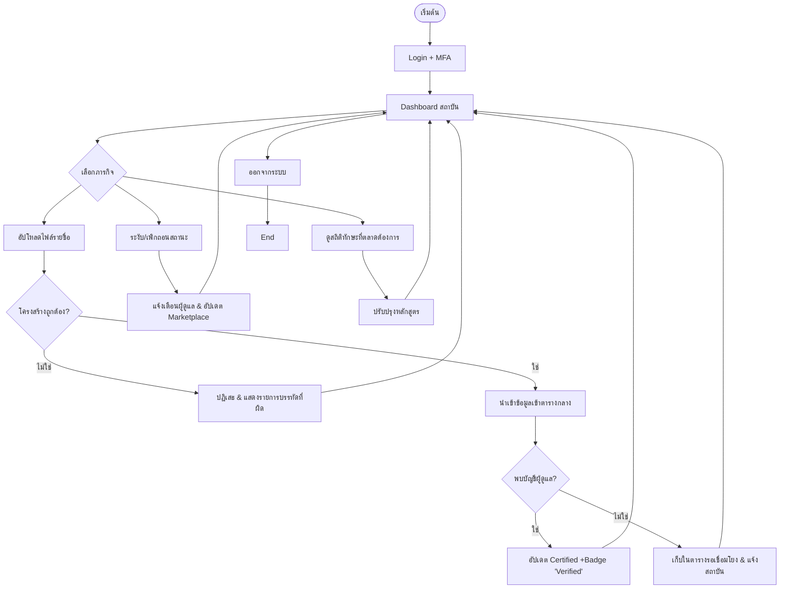

# 🎓 User Flow: Training Institute (CareDee Platform)

เอกสารฉบับนี้สกัดขั้นตอนการทำงาน (User Flow) ของสถาบันฝึกอบรม (Training Provider) จากเอกสาร SRS (v1.1) และข้อกำหนดโครงการ เพื่อใช้เป็นแนวทางในการเชื่อมโยงข้อมูลการรับรองมาตรฐานบุคลากร

---

## 🔐 1. กระบวนการเข้าสู่ระบบและรักษาความปลอดภัย (Auth & Security Flow)

| ลำดับขั้นตอน | รายละเอียด / เงื่อนไข | อ้างอิง SRS |
| --- | --- | --- |
| **Portal Login** | เข้าใช้งานผ่าน Web Portal | PF-TI-001 |
| **Security Logic** | ล็อกอินผิด **5 ครั้ง** $\rightarrow$ **ระงับการเข้าถึง 15 นาที** | Module 3.2.1 |
| **MFA** | บังคับใช้การยืนยันตัวตนสองขั้นตอน (Two-Factor Authentication) | NF-SEC-003 |
| **Dashboard** | แสดงเมนูอัปโหลดข้อมูล และสถิติตลาดแรงงาน | PF-TI-003 |

---

## 📥 2. การนำเข้าข้อมูลผู้ผ่านการอบรม (Import Trainee Data)

1. **Upload File (FR-TI-001):**
   - สถาบันเลือกไฟล์รายชื่อผู้ผ่านการอบรม (รองรับ **CSV, XLSX, JSON**)
   - **Validation:** ระบบตรวจสอบโครงสร้างไฟล์ หากผิดพลาดจะปฏิเสธและแสดงรายการบรรทัดที่มีปัญหา (Exception Handling 3.2.10)
2. **Process Records:** ระบบนำเข้าข้อมูลเข้าสู่ตารางกลาง
3. **Report:** ระบบรายงานจำนวนเรคคอร์ดที่นำเข้าสำเร็จและที่ผิดพลาด

---

## 🏅 3. การออกใบรับรองและเชื่อมโยงบัญชี (Certificate Linkage)

1. **Automated Matching (FR-TI-002):**
   - ระบบตรวจสอบความตรงกันของรหัสประจำตัว หรือ อีเมล กับบัญชีผู้ดูแลในระบบ
2. **Linkage Result:**
   - **Match Found:** อัปเดตสถานะเป็น **"ได้รับการรับรอง" (Certified)** ในโปรไฟล์ผู้ดูแลทันที และแสดง Badge 'Verified'
   - **Match Not Found:** เก็บข้อมูลใน **"ตารางรอเชื่อมโยง"** และแจ้งเตือนสถาบันเพื่อรอการสมัครสมาชิกของผู้ดูแลรายนั้น (Exception Handling 3.2.10)
3. **Locking:** ข้อมูลใบรับรองที่เชื่อมโยงแล้วจะถูกล็อกเพื่อป้องกันการแก้ไขโดยพลการ

---

## 🚫 4. การระงับหรือเพิกถอนสถานะ (Suspension & Revocation)

1. **Search Profile:** ค้นหาโปรไฟล์ผู้ดูแลที่ต้องการจัดการ
2. **Action (FR-TI-003):**
   - ระบุเหตุผลและวันที่เริ่มระงับ/เพิกถอนสถานะ
3. **System Update:** สถานะใน Marketplace เปลี่ยนเป็น "ระงับ" ทันที และระบบแจ้งเตือนไปยังผู้ดูแลและ Admin ทราบ

---

## 📈 5. การตรวจสอบความต้องการตลาด (Market Demand Analysis)

1. **Access Stats (FR-TI-004):**
   - สถาบันดูสถิติทักษะที่ตลาดต้องการ (คำนวณจากคำค้นหาและการจองย้อนหลัง 3 เดือน)
2. **Curriculum Alignment:** ใช้ข้อมูลเพื่อปรับปรุงหลักสูตรให้สอดคล้องกับความต้องการจริงของตลาดแรงงาน (PF-TI-003)

---

## 🗺️ Visual Flow (Mermaid Diagram)

---
*หมายเหตุ: ทุกการนำเข้าและเปลี่ยนแปลงข้อมูลจะถูกบันทึกใน Audit Log ตามมาตรฐานความปลอดภัยของระบบ*
