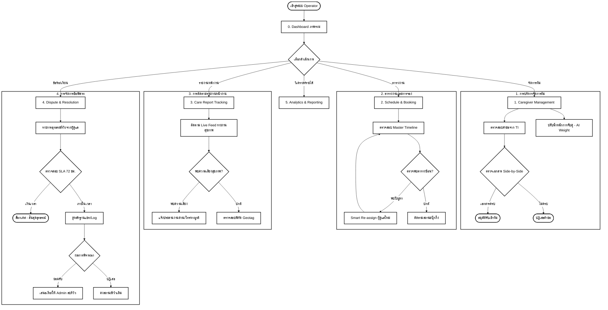

# User Flow: CareDee Operator Portal (Version 2)

เอกสารฉบับนี้อธิบายลำดับการใช้งาน (User Flow) ของผู้ให้บริการ (Operator) ซึ่งเน้นการบริหารจัดการทีมผู้ดูแล การจัดตารางงาน และการควบคุมคุณภาพการให้บริการในสังกัด

---

## 1. ผังการทำงานภาพรวม (Main Flow Diagram)

---

## 2. รายละเอียดขั้นตอนการทำงาน (Detailed Workflows)

### 0. Dashboard (ภาพรวมการปฏิบัติงาน)
- **จุดประสงค์:** ติดตาม "ชีพจร" ของทีมในสังกัดแบบ Real-time
- **ข้อมูลสำคัญ:** Utilization Rate ของทีม, รายได้สุทธิหลังหัก GP 15%, และการแจ้งเตือนเหตุการณ์ฉุกเฉิน (Critical Alert)
- **Feature สำคัญ:** ระบบ Real-time Sync Indicator แสดงสถานะการเชื่อมต่อข้อมูลกับเซิร์ฟเวอร์

### 1. จัดการทีมผู้ดูแล (Caregiver Management)
- **การรับผู้ดูแลใหม่:** ตรวจสอบรายชื่อที่ส่งมาจากสถาบันฝึกอบรม (TI) พร้อมเปรียบเทียบเอกสารแบบ Side-by-Side
- **Decision:** อนุมัติ (Verify) หรือ ปฏิเสธ (Reject) ตามความถูกต้องของเอกสาร
- **AI Matching Config:** Operator สามารถปรับน้ำหนัก (Weighting) ระหว่าง "ระยะทาง" และ "คะแนนรีวิว" เพื่อให้ระบบแนะนำผู้ดูแลที่เหมาะสมที่สุดตามนโยบายของหน่วยงาน

### 2. ตารางงาน & การจอง (Schedule & Booking)
- **Master Schedule:** ดูผังเวลาการทำงานของผู้ดูแลทุกคนในรูปแบบ Timeline
- **Conflict Management (Decision):** หากเกิดกรณีตารางงานซ้อนหรือผู้ดูแลไม่พร้อมทำงาน ระบบจะใช้ "Smart Re-assign" เพื่อหาผู้ดูแลคนอื่นที่เหมาะสมแทนที่ทันที
- **Geotag Monitoring:** ดูตำแหน่งพิกัดการเช็กอินจริงเทียบกับพิกัดบ้านลูกค้า

### 3. ติดตามรายงานหน้างาน (Care Report Tracking)
- **Live Feed:** รายงานกิจกรรมสุขภาพ (Vitals) และรูปภาพส่งตรงจากหน้างาน
- **Emergency Action (Decision):** หาก AI หรือ Operator ตรวจพบความผิดปกติของสัญญาณชีพ (เช่น ความดันสูงเกิน) จะมีขั้นตอนแจ้งประสานงานด่วนทันที
- **Geotag Verification:** ตรวจสอบว่าผู้ดูแลเข้างานในรัศมีที่กำหนดหรือไม่ (ป้องกันการทุจริตเวลา)

### 4. ข้อร้องเรียน & อุทธรณ์รีวิว (Dispute Resolution)
- **SLA Control (Decision):** ระบบมีการนับถอยหลัง 3 วันทำการ (72 ชม.) หากเกินกำหนด ปุ่มดำเนินการจะถูกล็อกโดยอัตโนมัติ
- **Appeal Decision:** ตรวจสอบหลักฐานแชท (Chat Snippet) และพิกัด Log เพื่อตัดสินอุทธรณ์ให้ความเป็นธรรมแก่ผู้ดูแล
- **Integration:** คำร้องที่อนุมัติแล้วจะส่งต่อให้ System Admin เป็นผู้ดำเนินการลบออกจากระบบเป็นขั้นตอนสุดท้าย

### 5. รายงาน & รายได้ (Analytics & Reporting)
- **Settlement Logic:** ตรวจสอบยอดเงินโอนคืนจาก Platform Admin ตามสูตร **Gross - 15% GP = Net Payout**
- **Audit Trail:** ทุกการแก้ไขตารางงานหรือการตัดสินข้อพิพาทจะถูกบันทึกลงใน Audit Log ซึ่งเก็บรักษาไว้ 3 ปีตามมาตรฐาน PDPA

---
*จัดทำขึ้นอ้างอิงจาก Mockup Version 2 (Operator Portal) และ Rechecked ตรงตาม Requirement Spec v1.2*
