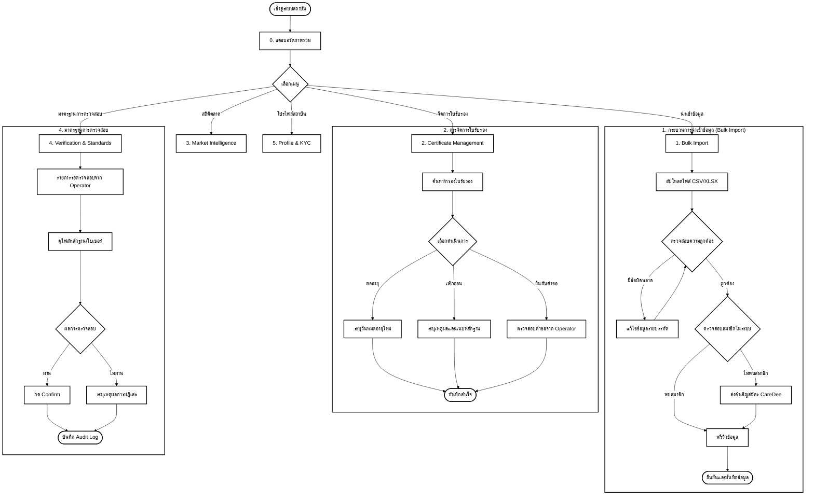

# User Flow: CareDee Training Institute Portal (Version 2)

เอกสารฉบับนี้อธิบายลำดับการใช้งาน (User Flow) ของระบบสถาบันการอบรม (Training Institute Portal) โดยครอบคลุมกระบวนการตั้งแต่การนำเข้าข้อมูล จนถึงการบริหารจัดการใบรับรองและการวิเคราะห์ตลาด

---

## 1. ผังการทำงานภาพรวม (Main Flow Diagram)

---

## 2. รายละเอียดขั้นตอนการทำงาน (Detailed Workflows)

### 0. แดชบอร์ด (Dashboard)
- **จุดประสงค์:** แสดงภาพรวมสถานะสถาบัน สถิติผู้เข้ารับการอบรม และทางลัดไปยังเมนูต่างๆ
- **ข้อมูลสำคัญ:** จำนวนผู้อบรมทั้งหมด, อัตราการเชื่อมโยงบัญชี, ดัชนีความต้องการตลาดแรงงาน
- **Decision Point:** ผู้ใช้สามารถเลือกจัดการสถานะใบรับรองรายบุคคลได้อย่างรวดเร็วผ่านช่องค้นหาบนแดชบอร์ด

### 1. นำเข้าข้อมูลการอบรม (Bulk Import)
- **ขั้นตอนการทำงาน:**
    1. **Upload:** อัปโหลดไฟล์รายชื่อผู้ผ่านการอบรม
    2. **Validation (Decision):** ระบบตรวจสอบรูปแบบข้อมูล (รหัส ปชช., รูปแบบวันที่)
        - หากผิด: แสดง Error Log และปุ่มแก้ไข
        - หากถูก: ไปยังขั้นตอนถัดไป
    3. **Matching:** ระบบตรวจสอบว่ารายชื่อในไฟล์มีบัญชีในระบบ CareDee หรือไม่
        - **Unmatched:** สามารถส่งคำเชิญ (Invite) ให้สมัครสมาชิกเพื่อให้ได้รับ Digital Badge โดยอัตโนมัติ
    4. **Confirmation:** ตรวจสอบความถูกต้องขั้นสุดท้ายก่อนกดบันทึกเข้าระบบ

### 2. จัดการใบรับรอง (Certificate Management)
- **ขั้นตอนการทำงาน:**
    1. ค้นหาใบรับรองด้วยเลขที่ใบเซอร์, ชื่อ, หรือรหัสประจำตัวประชาชน
    2. **Actions (Decision):**
        - **Renew:** สำหรับใบรับรองที่กำลังจะหมดอายุ (Expiring Soon)
        - **Revoke:** ในกรณีตรวจพบการทุจริตหรือพ้นสภาพ (ต้องระบุเหตุผลและแนบไฟล์หลักฐาน)
        - **Print:** พิมพ์หรือดาวน์โหลดใบรับรองดิจิทัล
- **Bulk Action:** สามารถเลือกหลายรายการเพื่อดำเนินการพร้อมกัน (เช่น ต่ออายุพร้อมกัน)

### 3. สถิติตลาดแรงงาน (Market Intelligence)
- **ขั้นตอนการทำงาน:**
    1. ดูแผนที่ความร้อน (Heatmap) ของพื้นที่ที่ขาดแคลนผู้ดูแล (Macro View)
    2. วิเคราะห์ความสอดคล้องของหลักสูตร (Course-Demand Fit)
    3. **Opportunity Search:** ดูคำค้นหาที่ "ไม่พบผู้ดูแล" เพื่อนำไปพัฒนาเป็นหลักสูตรใหม่ในอนาคต

### 4. มาตรฐานการตรวจสอบ (Verification & Standards)
- **ขั้นตอนการทำงาน:**
    1. รับคำร้องขอตรวจสอบใบรับรองจาก Operator (กรณีผู้ดูแลอัปโหลดไฟล์เอง)
    2. **Review:** ตรวจสอบไฟล์ภาพหลักฐานเทียบกับฐานข้อมูลของสถาบัน
    3. **Decision:**
        - **Confirm:** ยืนยันความถูกต้อง (ผู้ดูแลจะได้สถานะ Verified ทันที)
        - **Reject:** ปฏิเสธการยืนยัน (ต้องระบุเหตุผล เช่น เอกสารปลอม, ข้อมูลไม่ตรง)
    4. **Audit Log:** ทุกการดำเนินการจะถูกบันทึกเพื่อความโปร่งใสและตรวจสอบย้อนหลังได้

### 5. โปรไฟล์สถาบัน & KYC (Institute Profile)
- **ขั้นตอนการทำงาน:**
    1. ตรวจสอบและอัปเดตข้อมูลที่ตั้งและช่องทางการติดต่อของสถาบัน
    2. จัดการเอกสารยืนยันตัวตนสถาบัน (KYC) เช่น ใบอนุญาตจัดตั้ง เพื่อรักษาสถานะ **Verified Institute** บนแพลตฟอร์ม

---
*จัดทำขึ้นอ้างอิงจาก Mockup Version 2 (Training Portal)*
