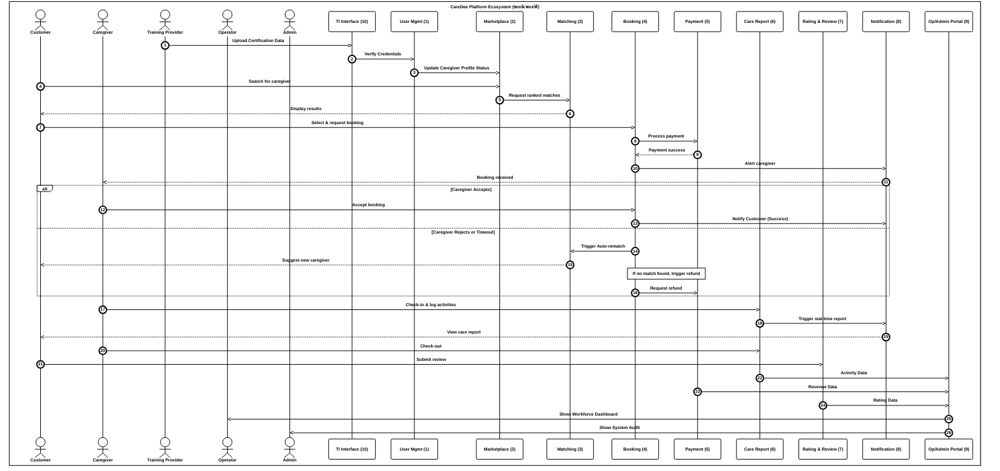
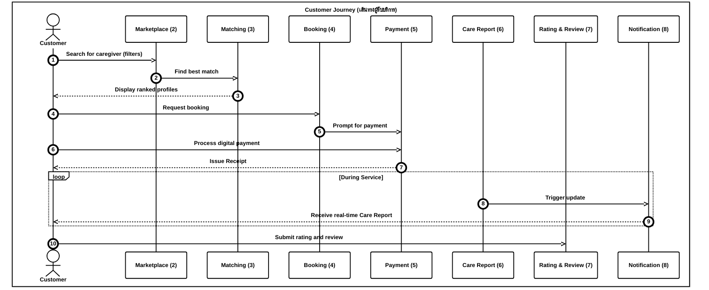
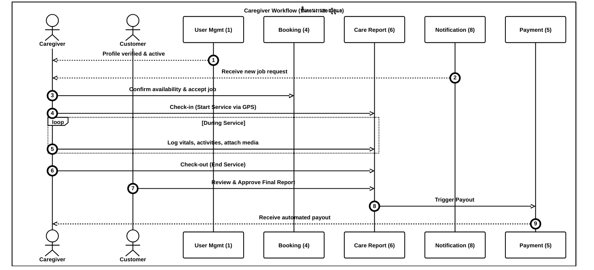
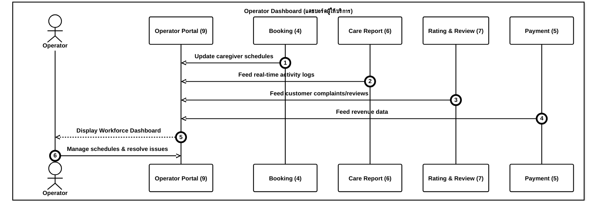
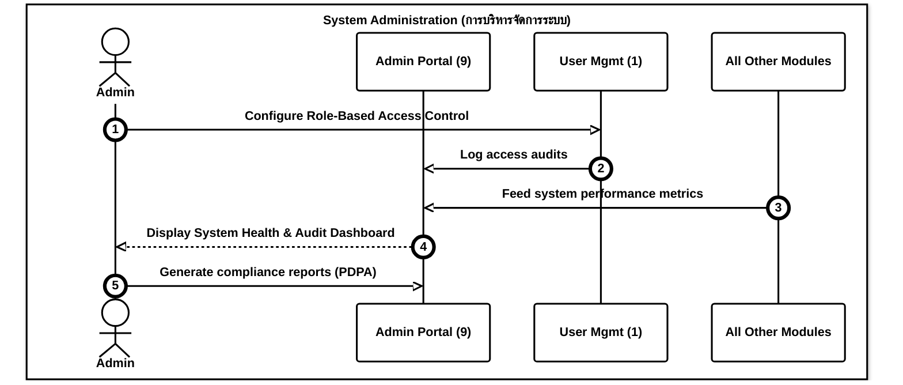
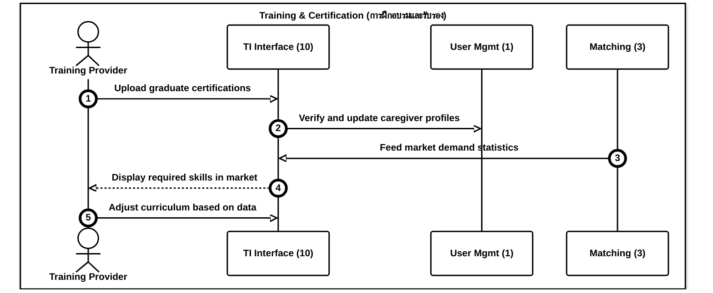

# CareDee Platform Workflows

เอกสารชุดนี้แสดงผังการทำงาน (Workflows) ของแพลตฟอร์ม CareDee โดยเริ่มจากภาพรวมระบบ และตามด้วยมุมมองแยกตามบทบาทของผู้ใช้งานทั้ง 5 กลุ่ม

---

## 1. System Overview (ภาพรวมระบบแคร์ดี)

Sequence diagram นี้แสดงการไหลของข้อมูลทั้งหมดผ่านทั้ง 5 บทบาท และ 10 โมดูลหลักของระบบ โดยเน้นการทำงานในรูปแบบ Platform Ecosystem ที่เชื่อมโยงผู้มีส่วนได้ส่วนเสียเข้าด้วยกันอย่างครบวงจร

**คำอธิบายทีละขั้นตอน (Step-by-step Explanation):**
*   **เตรียมความพร้อม (Pre-requisite):**
    *   **Step 1-2:** สถาบันฝึกอบรม (TI) อัปโหลดข้อมูลใบเซอร์ (10) เพื่อให้ระบบ User Mgmt (1) ตรวจสอบความถูกต้องของข้อมูล
    *   **Step 3:** ระบบ User Mgmt (1) ส่งสถานะการตรวจสอบไปยัง Marketplace (2) เพื่อยืนยันตัวตนผู้ดูแล
*   **Phase 1 & 2: ค้นหาและจอง (Search & Book):**
    *   **Step 4-6:** ลูกค้า (C) ค้นหาผู้ดูแลผ่าน Marketplace (2) ซึ่งจะเรียก Matching (3) ให้แสดงผลลัพธ์ที่เรียงลำดับตามความเหมาะสม
    *   **Step 7-9:** ลูกค้า (C) เลือกผู้ดูแลและทำการจอง (4) ระบบจะส่งไปที่ Payment (5) เพื่อประมวลผลการชำระเงินและแจ้งกลับเมื่อสำเร็จ
    *   **Step 10-11:** ระบบจอง (4) แจ้งเตือนผ่าน Notification (8) ไปยังผู้ดูแล (CG) ว่ามีงานใหม่
    *   **Step 12-15 (เงื่อนไขการรับงาน):** หากผู้ดูแล (CG) ยอมรับงาน (12) ระบบจะแจ้งผลสำเร็จให้ลูกค้าทราบ (13) แต่หากปฏิเสธหรือหมดเวลา ระบบจะสั่ง Matching (3) ให้หาคนใหม่ (14) หรือสั่งคืนเงินผ่าน Payment (5) ในกรณีที่ไม่พบผู้ดูแลคนใหม่ (15)
*   **Phase 3: การให้บริการ (Service Delivery):**
    *   **Step 16-18:** ผู้ดูแล (CG) กด Check-in และบันทึกกิจกรรมผ่าน Care Report (6) ระบบจะยิงแจ้งเตือน (8) ให้ลูกค้า (C) ติดตามรายงานแบบ Real-time
    *   **Step 19:** ผู้ดูแล (CG) กด Check-out เมื่อสิ้นสุดการให้บริการ
*   **Phase 4: หลังการให้บริการ:**
    *   **Step 20:** ลูกค้า (C) ส่งคะแนนและรีวิวผ่านระบบ Rating & Review (7)
*   **สรุปผล (Aggregation):**
    *   **Step 21-25:** ระบบ Care Report (6), Payment (5) และ Rating (7) ส่งข้อมูลกิจกรรม รายได้ และคะแนน (21-23) เข้าสู่ Portal (9) เพื่อแสดงผล Dashboard ให้ Operator (24) และ Admin (25) ตรวจสอบคุณภาพและระบบงานตามลำดับ

---

## 2. Customer View (มุมมองผู้รับบริการ)

มุ่งเน้นการเดินทางของผู้รับบริการ (User Journey) ตั้งแต่การค้นหาจนถึงการประเมินผล เพื่อความสะดวก รวดเร็ว และความสบายใจของครอบครัว

**คำอธิบายทีละขั้นตอน (Step-by-step Explanation):**
*   **Step 1-3:** ลูกค้า (C) ค้นหาผู้ดูแลผ่าน Marketplace (2) โดย Matching (3) จะประมวลผลและแสดงโปรไฟล์ที่เรียงลำดับตามความเหมาะสม (Ranked Profiles)
*   **Step 4-5:** ลูกค้า (C) กดจอง (4) และระบบจะส่งไปยัง Payment (5) เพื่อให้ลูกค้าชำระเงิน
*   **Step 6-7:** ลูกค้า (C) ดำเนินการชำระเงิน (5) และได้รับใบเสร็จรับเงิน (Receipt) เมื่อสำเร็จ
*   **Step 8-9 (Loop):** ระหว่างการให้บริการ ระบบ Care Report (6) จะส่งสัญญาณผ่าน Notification (8) ให้ลูกค้า (C) ได้รับรายงานสุขภาพและกิจกรรมแบบ Real-time
*   **Step 10:** เมื่อจบงาน ลูกค้า (C) ส่งคะแนนและรีวิวผ่านระบบ Rating & Review (7) เพื่อให้คะแนนผู้ดูแลในระบบต่อไป

---

## 3. Caregiver View (มุมมองผู้ดูแล)

เน้นการจัดการตารางงาน การลงบันทึกการปฏิบัติงานที่ง่าย และความโปร่งใสของรายได้

**คำอธิบายทีละขั้นตอน (Step-by-step Explanation):**
*   **Step 1:** ระบบ User Mgmt (1) ยืนยันว่าโปรไฟล์ของผู้ดูแล (CG) พร้อมใช้งาน (Active)
*   **Step 2-3:** ผู้ดูแล (CG) ได้รับแจ้งเตือนงานใหม่ (8) และกดตอบรับการจองผ่านระบบ Booking (4)
*   **Step 4:** เมื่อถึงหน้างาน ผู้ดูแล (CG) กด Check-in ผ่านระบบ Care Report (6) (บันทึกเวลาและ GPS)
*   **Step 5 (Loop):** ระหว่างงาน ผู้ดูแล (CG) บันทึกข้อมูลสุขภาพ กิจกรรม และแนบสื่อต่างๆ ผ่าน Care Report (6)
*   **Step 6:** เมื่อเสร็จงาน ผู้ดูแล (CG) กด Check-out (End Service) ผ่าน Care Report (6)
*   **Step 7:** ลูกค้า (C) ตรวจสอบและกดยอมรับรายงานฉบับสุดท้าย (Final Report) ผ่าน Care Report (6)
*   **Step 8-9:** ระบบ Care Report (6) ส่งสัญญาณให้ Payment (5) ดำเนินการโอนเงิน (Payout) ให้ผู้ดูแล (CG) โดยอัตโนมัติ

---

## 4. Operator View (มุมมองผู้ให้บริการ)

มุ่งเน้นการบริหารจัดการทีมผู้ดูแล (Workforce Management) การควบคุมคุณภาพ และการวิเคราะห์รายได้ของหน่วยงาน

**คำอธิบายทีละขั้นตอน (Step-by-step Explanation):**
*   **Step 1:** ระบบ Booking (4) ส่งข้อมูลตารางงานและการเปลี่ยนแปลงตารางงานของผู้ดูแลเข้าสู่ Operator Portal (9)
*   **Step 2:** ระบบ Care Report (6) ส่งบันทึกกิจกรรมแบบ Real-time ของผู้ดูแลทุกคนเข้าสู่ Portal (9)
*   **Step 3:** ระบบ Rating & Review (7) ส่งข้อมูลการร้องเรียนและรีวิวจากลูกค้าเข้าสู่ Portal (9)
*   **Step 4:** ระบบ Payment (5) ส่งข้อมูลรายได้และการเงินเข้าสู่ Portal (9)
*   **Step 5:** Operator Portal (9) ประมวลผลและแสดงข้อมูลทั้งหมดในรูปแบบ Workforce Dashboard ให้ Operator (OP) เห็นภาพรวม
*   **Step 6:** Operator (OP) ใช้ข้อมูลบน Portal (9) ในการจัดการตารางงานและแก้ไขปัญหาการปฏิบัติงานต่างๆ

---

## 5. Admin View (มุมมองผู้ดูแลระบบ)

มุ่งเน้นการรักษาความมั่นคงปลอดภัยของข้อมูล (Security) การกำหนดสิทธิ์ (RBAC) และการปฏิบัติตามกฎหมาย PDPA

**คำอธิบายทีละขั้นตอน (Step-by-step Explanation):**
*   **Step 1:** Admin (AD) กำหนดสิทธิ์การเข้าถึงข้อมูลรายโมดูลผ่านระบบ User Mgmt (1) (Role-Based Access Control)
*   **Step 2:** ระบบ User Mgmt (1) ส่งประวัติการเข้าใช้งาน (Access Audits) เข้าสู่ Portal (9)
*   **Step 3:** ทุกโมดูลในระบบ ส่งข้อมูลประสิทธิภาพและการทำงาน (System Performance Metrics) เข้าสู่ Portal (9)
*   **Step 4:** Admin Portal (9) แสดงผล Dashboard สุขภาพของระบบ (System Health) และประวัติการตรวจสอบให้ Admin (AD) เห็น
*   **Step 5:** Admin (AD) ใช้ Portal (9) ในการสร้างรายงานการปฏิบัติตามกฎหมาย (เช่น PDPA Compliance Reports)

---

## 6. Training Institute View (มุมมองสถาบันฝึกอบรม)

เน้นการยระดับมาตรฐานบุคลากรและการใช้ข้อมูลเพื่อพัฒนาหลักสูตรให้ตรงกับความต้องการของตลาด

**คำอธิบายทีละขั้นตอน (Step-by-step Explanation):**
*   **Step 1:** สถาบันฝึกอบรม (TI) อัปโหลดข้อมูลการสำเร็จการศึกษาและใบเซอร์ผ่าน TI Interface (10)
*   **Step 2:** TI Interface (10) ตรวจสอบและอัปเดตข้อมูลประวัติผู้ดูแลในระบบ User Mgmt (1) เพื่อยืนยันคุณภาพ
*   **Step 3:** Matching Engine (3) ส่งข้อมูลสถิติความต้องการทักษะในตลาด (Market Demand) กลับไปยัง TI Interface (10)
*   **Step 4:** TI Interface (10) แสดงผลข้อมูลทักษะที่เป็นที่ต้องการของตลาดให้สถาบันฝึกอบรม (TI) ทราบ
*   **Step 5:** สถาบันฝึกอบรม (TI) นำข้อมูลที่ได้รับไปปรับปรุงหลักสูตรการสอน (Curriculum) ให้สอดคล้องกับความต้องการจริงของตลาดแรงงาน

---

## 7. Booking State Machine (สถานะการจอง)

เพื่อความถูกต้องในการเขียนโปรแกรม สถานะย่อยของการจอง (Booking) ถูกกำหนดไว้ดังนี้:

| State | Description | Next Possible State(s) |
| :--- | :--- | :--- |
| `Pending_Payment` | ลูกค้ากดจองแต่ยังไม่ได้ชำระเงิน | `Pending_Acceptance`, `Cancelled` |
| `Pending_Acceptance` | ชำระเงินสำเร็จ ระบบกำลังรอผู้ดูแลกดยืนยันรับงาน | `Confirmed`, `Auto_Rematching`, `Cancelled_Refunded` |
| `Auto_Rematching` | ผู้ดูแลปฏิเสธหรือหมดเวลา ระบบกำลังจับคู่คนใหม่ให้ | `Pending_Acceptance`, `Cancelled_Refunded` |
| `Confirmed` | ผู้ดูแลรับงานแล้ว รอเวลาเริ่มให้บริการ | `In_Progress`, `Cancelled_Refunded` |
| `In_Progress` | ผู้ดูแลกด Check-in และเริ่มให้บริการ | `Awaiting_Final_Approval` |
| `Awaiting_Final_Approval` | ผู้ดูแลกด Check-out และส่งรายงานฉบับสุดท้าย | `Completed`, `Disputed` |
| `Completed` | ลูกค้ากด Approve รายงานและระบบโอน Payout สำเร็จ | - |
| `Cancelled_Refunded` | การจองถูกยกเลิกและระบบคืนเงินให้ลูกค้าเรียบร้อย | - |
| `Disputed` | เกิดข้อพิพาทระหว่างลูกค้าและผู้ดูแล (รอดำเนินการโดย Operator) | `Completed`, `Cancelled_Refunded` |

---

## 8. Notification Matrix (ตารางการแจ้งเตือน)

กำหนดประเภทและช่องทางการแจ้งเตือนสำหรับ Event สำคัญใน Workflow:

| Event | Target | Channel | Content / Purpose |
| :--- | :--- | :--- | :--- |
| **New Job Request** | Caregiver | Push | แจ้งเตือนงานใหม่และรายละเอียดเบื้องต้น |
| **Payment Success** | Customer | Email / Push | ยืนยันการชำระเงินและส่ง E-Receipt |
| **Booking Confirmed** | Customer | Push | แจ้งว่าผู้ดูแลตอบรับงานแล้ว |
| **Check-in/Out** | Customer | Push | แจ้งสถานะการเริ่มและจบงานของผู้ดูแล |
| **Real-time Report** | Customer | Push | แจ้งเตือนเมื่อมีบันทึกกิจกรรมใหม่ใน Care Report |
| **Approval Required**| Customer | Push / SMS | แจ้งให้ลูกค้าตรวจสอบรายงานฉบับสุดท้ายเพื่อปิดงาน |
| **Payout Success** | Caregiver | Push | แจ้งเตือนเมื่อเงินค่าตอบแทนถูกโอนเข้าบัญชี |
| **Auto-Rematch Alert**| Customer | Push | แจ้งว่าระบบกำลังหาคนใหม่ให้กรณีคนเดิมไม่ว่าง |
| **Refund Processed** | Customer | Email | แจ้งยืนยันการคืนเงินสำเร็จ |

