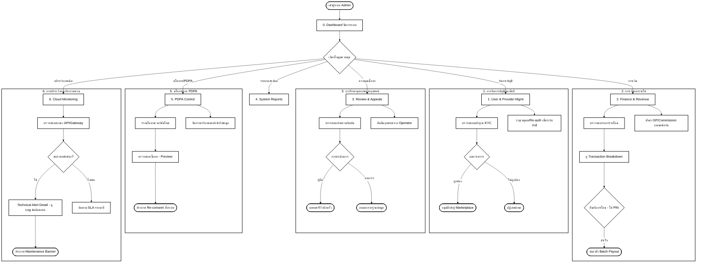

# User Flow: CareDee Admin Portal (Version 2)

เอกสารฉบับนี้อธิบายลำดับการใช้งาน (User Flow) ของผู้บริหารระบบแพลตฟอร์ม (System Admin / Platform Operator) ซึ่งเป็นศูนย์กลางในการควบคุมความปลอดภัย การเงิน และความน่าเชื่อถือของแพลตฟอร์มทั้งหมด

---

## 1. ผังการทำงานภาพรวม (Main Flow Diagram)

---

## 2. รายละเอียดขั้นตอนการทำงาน (Detailed Workflows)

### 0. Dashboard (ศูนย์กลางการควบคุม)
- **จุดประสงค์:** ติดตามความเสถียรของระบบ (System Uptime) และรายการด่วนที่ต้องดำเนินการ
- **ข้อมูลสำคัญ:** ยอดจองรวมทั้งแพลตฟอร์ม, อัตรา Availability, และคิวรออนุมัติล่าสุด
- **Strategic Tool:** ระบบ Maintenance Broadcaster สำหรับส่งข้อความประกาศถึงผู้ใช้ทุกกลุ่มทันที (พร้อมระบบ Preview ก่อนประกาศจริง)

### 1. การจัดการบัญชีผู้ใช้ (User & Provider Management)
- **KYC Verification:** ตรวจสอบเอกสารตัวตน (ID Card) และใบเซอร์ (Certs) ที่เชื่อมโยงจาก TI ผ่าน API
- **Decision:** การอนุมัติ (Approve) หรือระงับสิทธิ์ (Suspend) จะต้องมีการใส่รหัสผ่านแอดมิน (**Double Confirmation**) และระบุ Reason Code เพื่อบันทึก Audit Log ทุกครั้ง
- **Bulk Action:** แถบจัดการข้อมูลจำนวนมาก (Batch Approval) เพื่อประสิทธิภาพสูงสุดในการจัดการผู้ใช้หลายรายการพร้อมกัน

### 2. การจัดการการเงิน (Finance & Revenue)
- **Payout Management:** ตรวจสอบยอดสุทธิที่ต้องโอนคืนให้ผู้ดูแล/Operator (Gross - GP = Net)
- **Transaction Breakdown:** ดูรายละเอียดที่มาของยอดเงิน (Payout Breakdown) เพื่อความโปร่งใสก่อนโอน
- **Decision (Security):** การโอนเงินคืน (Payout) ต้องผ่านระบบ PIN Verification และบันทึก Audit Log ตามมาตรฐาน PF-FIN-001

### 3. คุณภาพรีวิว & อุทธรณ์ (Review Quality & Appeals)
- **Auto-Moderation:** ระบบจะบังคับใช้ Masking (เบลอ) ข้อความที่ไม่สุภาพโดยอัตโนมัติเพื่อให้แอดมินคลิกตรวจสอบ
- **Evidence Viewer:** แอดมินตรวจสอบหลักฐานแชทหรือรูปภาพประกอบก่อนตัดสินผลการอุทธรณ์
- **Appeal SLA (Decision):** แอดมินต้องตัดสินผลการอุทธรณ์รีวิวจากผู้ดูแลภายใน 3 วันทำการ (72 ชม.)

### 4. รายงานระบบ (System Reports & Insights)
- **Strategic Insights:** ดูแผนที่ความร้อน (**Interactive Heatmap**) ของพื้นที่ที่ Demand สูงแต่ Supply ต่ำ เพื่อวางแผนขยายการตลาด
- **Financial Reconciliation:** ตรวจสอบส่วนต่างของยอดโอนในระบบกับยอด Settled จริงจากธนาคาร
- **Custom Reporting:** สามารถกำหนดช่วงเวลา (**Custom Date Range**) และประเภทไฟล์ (PDF/XLSX) เพื่อส่งออกรายงานผู้บริหาร

### 5. นโยบาย & PDPA (Privacy Control Center)
- **Consent Versioning:** จัดการเวอร์ชันของนโยบายความเป็นส่วนตัวและ Terms of Use
- **Audit Trail Context:** ระบบบันทึกประวัติการเข้าถึงข้อมูลส่วนบุคคล (Access Log) ตามกฎหมาย PDPA
- **Broadcast Decision:** เมื่อเปลี่ยนกฎหมาย สามารถสั่ง Trigger Re-consent เพื่อบังคับให้ผู้ใช้ทุกคนกดยอมรับใหม่ก่อนเข้าใช้งาน

### 6. เฝ้าระวังระบบคลาวด์ (Cloud Monitoring)
- **Service Health:** ตรวจสอบสถานภาพของ Main API, SMS Gateway และ Payment Gateway แบบรายวินาที
- **Incident Analysis:** ลิงก์ดูรายละเอียดข้อผิดพลาดทางเทคนิค (**Technical Alert Detail**) เพื่อวินิจฉัยปัญหาเบื้องต้น
- **Emergency Action:** หากระบบล่ม แอดมินสามารถกดประกาศ Maintenance Banner (สีแดง) ซึ่งจะแสดงผล "ทุกหน้าแแอป" ทันที

---
*จัดทำขึ้นอ้างอิงจาก Mockup Version 2 (Admin Portal SPA) และ Gaps Analysis ใน PORTAL_DOCUMENTATION.md*
