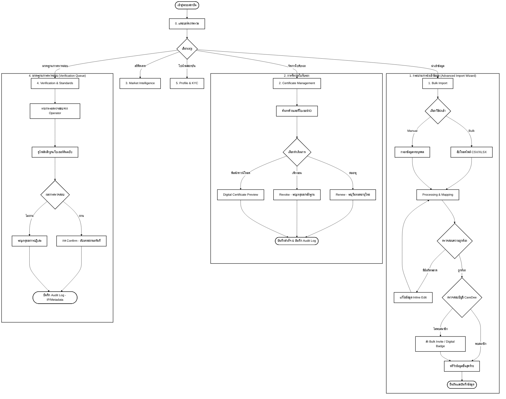

# User Flow: CareDee Training Institute Portal (Version 2)

เอกสารฉบับนี้อธิบายลำดับการใช้งาน (User Flow) ของระบบสถาบันการอบรม (Training Institute Portal) โดยครอบคลุมกระบวนการตั้งแต่การนำเข้าข้อมูล จนถึงการบริหารจัดการใบรับรองและการวิเคราะห์ตลาด

---

## 1. ผังการทำงานภาพรวม (Main Flow Diagram)

---

## 2. รายละเอียดขั้นตอนการทำงาน (Detailed Workflows)

### 0. แดชบอร์ด (Dashboard)
- **จุดประสงค์:** แสดงภาพรวมสถานะสถาบัน และวิเคราะห์ความสอดคล้องของหลักสูตรกับตลาด
- **ข้อมูลสำคัญ:** Connectivity Stats (จำนวนผู้อบรมที่เชื่อมต่อบัญชี), ดัชนีความต้องการตลาดแรงงาน (Course-Demand Fit)
- **Decision Point:** วิเคราะห์คำค้นหาที่ "ไม่พบผู้ดูแล" เพื่อนำไปพัฒนาเป็นหลักสูตรใหม่ในอนาคต

### 1. นำเข้าข้อมูลการอบรม (Advanced Import Wizard)
- **ขั้นตอนการทำงาน:**
    1. **Choice:** สลับโหมดได้ระหว่าง **Bulk Upload** (XLSX/CSV) และ **Manual Entry** (กรอกเอง)
    2. **Processing & Mapping:** ระบบจัดโครงสร้างข้อมูลและตรวจสอบความซ้ำซ้อน
    3. **Validation (Decision):** ตรวจสอบรูปแบบข้อมูล หากผิดสามารถใช้ **Inline Edit** แก้ไขบนหน้าจอได้ทันที
    4. **Matching & Invite:** ตรวจสอบบัญชีในระบบ หากไม่พบ สามารถส่งคำเชิญ (Invite) เพื่อรับ **Digital Badge** อัตโนมัติเมื่อสมัครสมาชิก
    5. **Confirmation:** ตรวจสอบความถูกต้องขั้นสุดท้ายผ่าน Progress Bar 3 ขั้นตอนก่อนบันทึก

### 2. จัดการใบรับรอง (Certificate Management)
- **ขั้นตอนการทำงาน:**
    1. ค้นหาใบรับรองแบบละเอียด พร้อมระบบกรองสถานะ (Active/Expiring/Revoked)
    2. **Actions (Decision):**
        - **Renew:** สำหรับต่ออายุใบรับรอง
        - **Revoke:** สำหรับเพิกถอนในกรณีตรวจพบการทุจริต (ต้องระบุเหตุผลและบันทึก Audit Log)
        - **Print/Preview:** เปิดดูวุฒิบัตรดิจิทัล (**Digital Certificate Preview**)
- **Bulk UI:** สามารถเลือกหลายรายการเพื่อดำเนินการพร้อมกัน (Batch Action)

### 3. สถิติตลาดแรงงาน (Market Intelligence)
- **ขั้นตอนการทำงาน:**
    1. ดูแผนที่ความร้อน (**Interactive Heatmap**) ของพื้นที่ที่ขาดแคลนผู้ดูแลตามโซนต่างๆ
    2. **Unmet Demand Analysis:** วิเคราะห์ทักษะที่ตลาดต้องการแต่ยังไม่มีผู้ดูแลเพียงพอ
    3. **Curriculum Adjustment:** นำข้อมูลความต้องการจริงมาปรับปรุงหลักสูตรให้ทันสมัย

### 4. มาตรฐานการตรวจสอบ (Verification & Standards)
- **ขั้นตอนการทำงาน:**
    1. รับคำร้องขอตรวจสอบใบรับรองจาก Operator ในรูปแบบ **Verification Queue**
    2. **Review:** ตรวจสอบไฟล์ภาพวุฒิบัตรต้นฉบับเทียบกับฐานข้อมูลของสถาบัน
    3. **Decision:**
        - **Confirm:** ยืนยันความถูกต้อง (ผู้ดูแลจะได้สถานะ Verified ทันที)
        - **Reject:** ปฏิเสธการยืนยัน (ต้องระบุเหตุผล)
    4. **Audit Log:** บันทึก Metadata และ IP Address ของผู้ตรวจสอบเพื่อความโปร่งใส (PDPA Compliance)

### 5. โปรไฟล์สถาบัน & KYC (Institute Profile)
- **ขั้นตอนการทำงาน:**
    1. จัดการข้อมูลสถาบันและช่องทางการติดต่อ
    2. อัปโหลดเอกสารยืนยันตัวตนสถาบัน (KYC) เพื่อรักษาสถานะ **Verified Institute** และสร้างความเชื่อมั่นบนแพลตฟอร์ม

---
*จัดทำขึ้นอ้างอิงจาก Mockup Version 2 (Training Portal SPA) และ Gaps Analysis ใน PORTAL_DOCUMENTATION.md*
